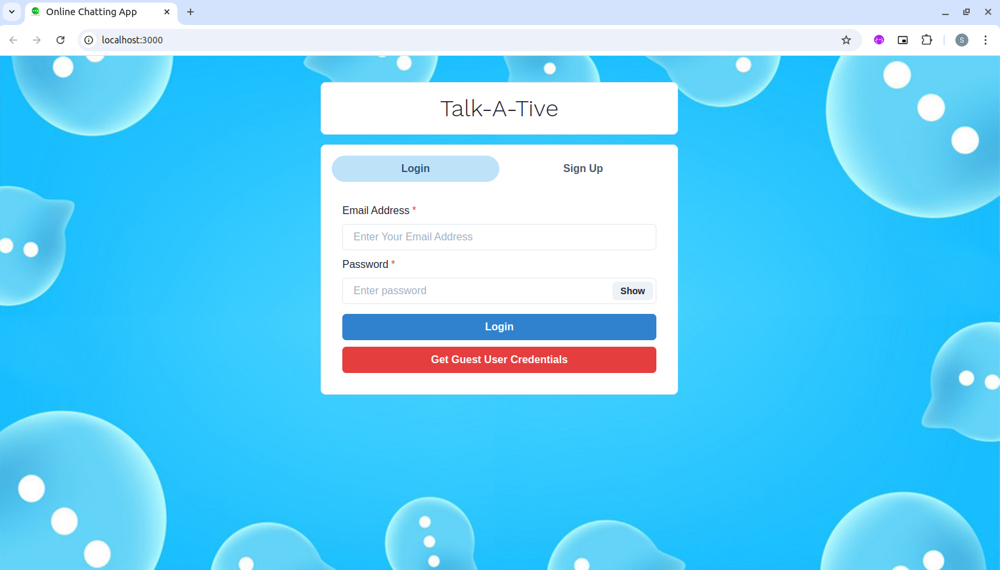

# Online Chatting App with Media Sharing

## Screenshots

This project is a real-time online chat application that supports instant messaging and media sharing, built with [React](https://react.dev/) on the front end and [Express](https://expressjs.com/) with [Socket.io](https://socket.io/) on the backend. The app allows users to register, log in securely using [bcryptjs](https://www.npmjs.com/package/bcryptjs) and [JSON Web Tokens](https://jwt.io/), and engage in dynamic chatrooms. Key features include animated UI elements via [Framer Motion](https://motion.dev/) and [Lottie](https://lottiefiles.com/), live chat notifications using [react-notification-badge](https://www.npmjs.com/package/react-notification-badge), and a scrollable message feed powered by [react-scrollable-feed](https://www.npmjs.com/package/react-scrollable-feed).

Users can upload images and media through [Cloudinary](https://cloudinary.com/) integration, enabling seamless, high-quality media sharing. Socket.io facilitates real-time message and media delivery, creating a responsive chat experience. With [React-Chips](https://www.npmjs.com/package/react-chips) for tagging users and [react-router-dom](https://www.npmjs.com/package/react-router-dom) for navigation, the app also includes secure backend support through Express and [Mongoose](https://www.npmjs.com/package/mongoose) for [MongoDB](https://www.mongodb.com/). Development is optimized using [dotenv](https://www.npmjs.com/package/dotenv) for configuration, [colors](https://www.npmjs.com/package/colors) for logging, and [nodemon](https://www.npmjs.com/package/nodemon) for real-time server updates.

This project is perfect for learning full-stack web development, media handling, and real-time data interactions.

## ⚙️ Languages or Frameworks Used

`Front-end` -

+  `axios`
+  `chat-app`
+  `framer-motion`
+  `react`
+  `react-chips`
+  `react-dom`
+  `react-lottie`
+  `react-notification-badge`
+  `react-router-dom`
+  `react-scripts`
+  `react-scrollable-feed`
+  `socket.io-client`
+  `web-vitals`
  
`Back-end` -

+ `bcryptjs`
+ `colors`
+ `dotenv`
+ `express`
+ `express-async-handler`
+ `jsonwebtoken`
+ `mongoose`
+ `nodemon`
+ `socket.io`
